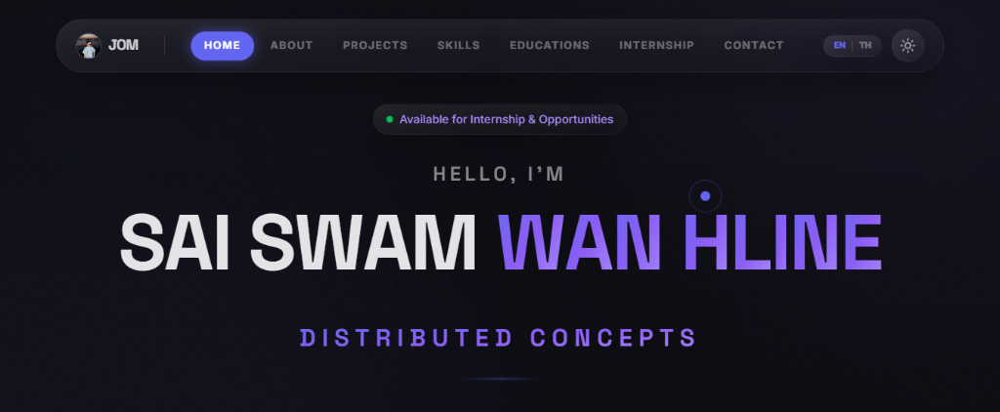

# Hey there! I'm Jom 👋

  
  
  
  
  

### 💻 Visit My Live Portfolio: [jomwan.vercel.app](https://jomwan.vercel.app/)

---

## 🚀 About Me
I am a passionate data professional and engineer with a deep interest in building scalable distributed systems, real-time streaming ML pipelines, agent-based simulation models, and premium full-stack web applications. 

* 🛠️ Currently developing premium Full-Stack systems and Data pipelines.
* 🔭 Specialize in the **Medallion Data Lakehouse Architecture** and **AI Ensemble inference**.
* ⚡ Love implementing fluid glassmorphic visual designs and interactive analytics dashboards.

---

## 🛠️ Skills & Technologies

<table align="center" width="100%">
  <tr>
    <td width="50%" valign="top">
      <h3>💻 Languages & Core</h3>
      
      
      
      
    </td>
    <td width="50%" valign="top">
      <h3>⚙️ Big Data & Pipelines</h3>
      
      
      
      
    </td>
  </tr>
  <tr>
    <td width="50%" valign="top">
      <h3>🧠 Machine Learning & AI</h3>
      
      
      
      
    </td>
    <td width="50%" valign="top">
      <h3>🎨 Frontend & Web</h3>
      
      
      
      
    </td>
  </tr>
</table>

---

## 🚀 Highlighted Work

### 🛡️ [Enterprise Real-Time Fraud Detection](https://github.com/jomwan/Fraud-Detection)
> A state-of-the-art financial crime monitoring system running on multi-model AI ensembles.

  
<b>📐 Architecture details</b>

  
  - **Medallion Pipeline**: Partitioned JSONL (Bronze) ➔ Enriched schema CSVs with ML scores (Silver) ➔ Business aggregate KPIs (Gold).
  - **AI Ensemble**: XGBoost (40% weight) + Isolation Forest (25% weight) + Deep PyTorch LSTM (35% weight) + Graph Centrality (Neo4j).

### 📊 [Databricks Fraud Ingestion Pipeline](https://github.com/jomwan/databrick-fraud-detection)
> Cloud-native Delta Lakehouse implementation featuring real-time stream ingestion.

  
<b>📐 Architecture details</b>

  
  - **Pipeline**: Declarative Delta Live Tables (DLT) with strict data validation gates.
  - **Serving**: MLflow models loaded dynamically from Unity Catalog inside a Structured Streaming loop. Streamlit front-end visualization.

### 📈 [TikTok Trend Diffusion ABM](https://github.com/jomwan/TikTok_ABM)
> Agent-Based Model simulating Songkran festival consumer purchase conversion from viral TikTok trend data.

  
<b>📐 Simulation details</b>

  
  - **Core**: Watts-Strogatz small-world social network (Mesa / NetworkX).
  - **Funnel**: Unaware ➔ Aware ➔ Interested ➔ Purchased decision tree with impulse decay. Solara & Plotly dashboard.

### ⛳ [Golf Bookr Bangkok](https://github.com/jomwan/golf-bookr)
> A premium full-stack online booking system and AI chatbot concierge for golf clubs.

  
<b>📐 Stack details</b>

  
  - **Core**: React 18 frontend + Node.js/Express backend + WebSockets live schedules.
  - **AI Concierge**: Google Gemini 3.5 Flash customized agent managing course advice and slots.

---

## 🏆 GitHub Badges & Stats

  

 

  
  

